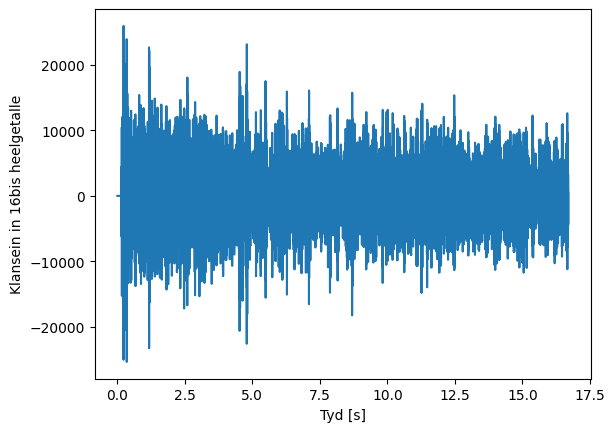
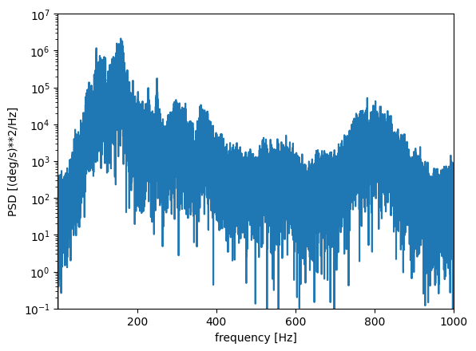
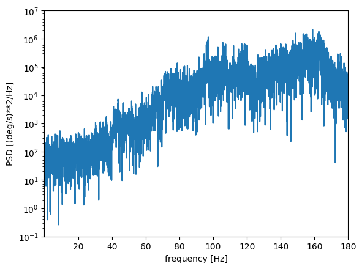

# Geraas meting op paneel in Suzuki Ertiga

Meet die geraas op 'n paneel agter in 'n Suzuki Ertiga wat begin vibreer by 80kph, maar die ergste vibreer  90kph.

Die opwekking is van die pad deur die bande, want as dit op growwe teer loop teen hierdie spoed vibreer die paneel, maar op baie gladde teer is die paneel stil.

Die motor het 'n R185/65R15 band.  Hierdie band het 'n naaf diameter van 15 duim en 'n band diameter van 24.47 duim.

Hierdie diameter is 'n band omtrek van 

24.47 duim = 621mm -> $\pi \times d$ = 3.141*621mm = 1950mm

Indien die ergste opwekking by 90kph is, bereken die rotasie frekwensie as volg:

90kph = 90000m/3600s = 25m/s

Rotasie frekwensie is dus:  25m/s/1.95m = 12.8Hz

Daar is 'n eerste piek by 10 maal hierdie frekwensie maar die hoogste piek is by 160Hz.  Daar kan aangeneem word dat die bande 'n wye geraasvloer opwek en dat die paneel se natuurlike frekwensie naby aan 160Hz is.

Indien die motor oor 'n ongelykheid of 'n impak ry, dan word die hele spektrum opgewek nes 'n impakhamer.

Dus werk die padgeraas meer soos 'n wye spektrum opwekking.  Dit is duidelik dat die opwekking van die enjin geen invloed op die paneel het nie.  Dit is net as gevolg van pad geruis dat die paneel vibreer.

Die tydsein is met 'n selfoon opgeneem met 'n voicenote.  Die voicenote is in die *.opus formaat.  Dit is afgelaai en ingelees in python en as volg geplot:

'n PSD is geneem van die tydsein en dit wys die pieke as volg:

Meer vergroot is die PSD as volg:  Daar is duidelike pieke by 160Hz en 800Hz

